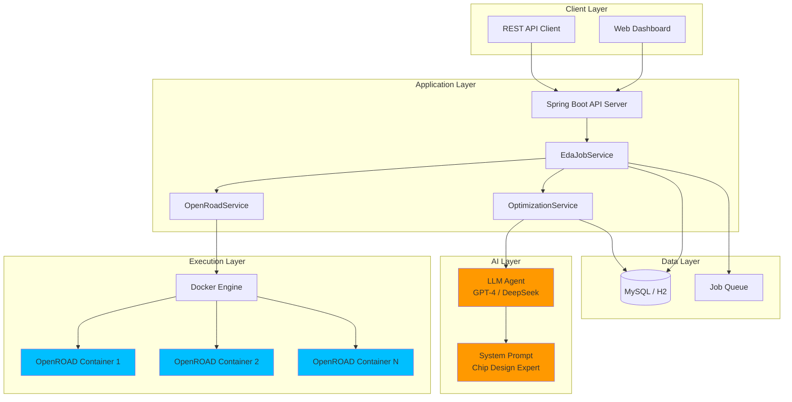
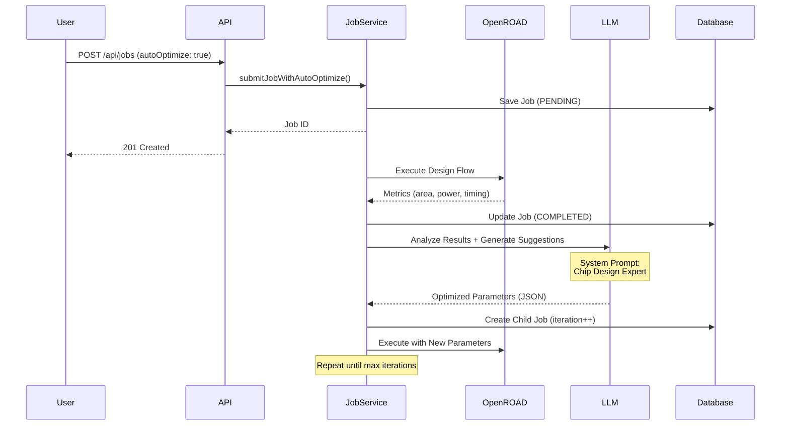

# Silicon-Agent-Flow

[](https://opensource.org/licenses/MIT)
[](https://openjdk.org/)
[](https://spring.io/projects/spring-boot)
[](https://www.docker.com/)

**AI-Driven Distributed EDA Scheduler for Next-Generation Chip Design Automation**

Silicon-Agent-Flow is a cloud-native, production-ready Electronic Design Automation (EDA) task orchestration platform that leverages Large Language Models (LLMs) for intelligent parameter optimization. Built on Spring Boot 3.x and designed for Kubernetes-native deployments, it seamlessly integrates with industry-standard EDA tools like OpenROAD to deliver autonomous, iterative chip design optimization.

---

## 🌟 Key Features

### Cloud-Native Architecture
- **Kubernetes-Ready**: Designed for horizontal scaling and high availability
- **Containerized Execution**: Docker-based isolation for EDA workloads
- **Async Task Processing**: Non-blocking job execution with Spring's async framework
- **Multi-Database Support**: H2 for development, MySQL/PostgreSQL for production

### LLM-Based Parameter Tuning
- **Autonomous Optimization**: AI agents analyze design metrics and suggest parameter improvements
- **Closed-Loop Iteration**: Automatic job creation and execution based on LLM recommendations
- **Multi-Model Support**: Compatible with OpenAI, DeepSeek, and local LLM deployments
- **Domain-Specific Prompts**: Engineered prompts for chip design expertise

### OpenROAD Integration
- **Industry-Standard Tools**: Native integration with OpenROAD flow
- **Dynamic TCL Generation**: Programmatic configuration file creation
- **Metrics Extraction**: Automated parsing of area, power, and timing results
- **Real-Time Logging**: Complete execution trace capture

### Enterprise-Grade Features
- **RESTful API**: Comprehensive API for job submission and monitoring
- **Optimization Tracking**: Parent-child job relationships for audit trails
- **Configurable Limits**: Max iteration controls and timeout management
- **Error Handling**: Robust failure recovery and detailed error reporting

---

## 🏗️ Architecture



### Workflow



---

## 🚀 Quick Start

### Prerequisites

- **Java 21+** (OpenJDK or Oracle JDK)
- **Docker & Docker Compose** (for containerized deployment)
- **Maven 3.8+** (for building from source)
- **LLM API Key** (OpenAI, DeepSeek, or local endpoint)

### One-Command Deployment

```bash
# Clone the repository
git clone https://github.com/yourusername/silicon-agent-flow.git
cd silicon-agent-flow

# Configure environment variables
cp .env.example .env
# Edit .env and add your LLM API credentials

# Start all services
docker-compose up -d

# Verify deployment
curl http://localhost:8080/actuator/health
```

### Configuration

Create a `.env` file with your LLM credentials:

```bash
# DeepSeek API (Recommended for cost efficiency)
OPENAI_API_KEY=sk-your-deepseek-api-key
OPENAI_BASE_URL=https://api.deepseek.com/v1

# Or OpenAI API
# OPENAI_API_KEY=sk-your-openai-api-key
# OPENAI_BASE_URL=https://api.openai.com/v1

# Or Local LLM (e.g., Ollama, vLLM)
# OPENAI_API_KEY=local-key
# OPENAI_BASE_URL=http://localhost:8000/v1
```

### Service Endpoints

| Service | URL | Description |
|---------|-----|-------------|
| API Server | http://localhost:8080 | Main application |
| H2 Console | http://localhost:8080/h2-console | Database UI (dev mode) |
| MySQL | localhost:3306 | Production database |

---

## 📖 API Documentation

### Submit a Job

```bash
POST /api/jobs
Content-Type: application/json

{
  "parameters": {
    "design_name": "my_chip",
    "technology": "28nm",
    "utilization": 70.0,
    "aspect_ratio": 1.0,
    "core_margin": 2.0,
    "target_frequency": 1200.0,
    "power_budget": 150.0
  },
  "autoOptimize": true
}
```

**Response:**
```json
{
  "id": 1,
  "status": "PENDING",
  "autoOptimize": true,
  "optimizationIteration": 0,
  "parentJobId": null,
  "createdAt": "2026-02-17T10:00:00"
}
```

### Query Job Status

```bash
GET /api/jobs/{id}
```

**Response:**
```json
{
  "id": 1,
  "status": "COMPLETED",
  "resultMetrics": {
    "area_um2": 2345.67,
    "power_mw": 123.45,
    "frequency_mhz": 1050.0,
    "timing_met": true
  },
  "autoOptimize": true,
  "optimizationIteration": 0
}
```

### Manual Optimization Trigger

```bash
POST /api/optimization/manual/{jobId}
```

**Response:**
```json
{
  "design_name": "my_chip_optimized",
  "utilization": 65.0,
  "aspect_ratio": 1.2,
  "optimization_reason": "Reduced utilization to improve routing, adjusted aspect ratio for timing"
}
```

---

## 🧠 LLM Agent Design

### System Prompt Engineering

The AI agent is configured with a domain-specific system prompt that establishes expertise in chip backend design:

```
You are a senior chip backend design expert with deep knowledge of digital IC design flows and EDA tool optimization.

Your task is to analyze chip design execution results, identify performance bottlenecks, and provide optimization recommendations.

Analysis Focus:
1. Area Optimization: Reduce chip area (area_um2)
2. Power Optimization: Lower power consumption (power_mw)
3. Timing Optimization: Improve frequency (frequency_mhz), ensure timing closure (timing_met)
4. Parameter Balancing: Find optimal trade-offs between area, power, and performance

Optimization Strategies:
- utilization: Utilization rate (40-90%) - too high causes routing issues, too low wastes area
- aspect_ratio: Aspect ratio (0.5-2.0) - affects routing and timing
- core_margin: Core margin (1.0-5.0) - impacts IO and power network
- target_frequency: Target frequency - affects timing constraints
- power_budget: Power budget - influences optimization targets
```

### Input Format

```json
{
  "current_parameters": { "utilization": 80.0, "aspect_ratio": 1.0, ... },
  "execution_results": { "area_um2": 2500.0, "power_mw": 160.0, ... },
  "log_summary": "...",
  "error_info": "...",
  "optimization_goal": "Reduce chip area and power consumption",
  "iteration": "1/10"
}
```

### Output Format

```json
{
  "design_name": "my_chip_opt_1",
  "technology": "28nm",
  "utilization": 70.0,
  "aspect_ratio": 1.2,
  "core_margin": 2.5,
  "target_frequency": 1150.0,
  "power_budget": 160.0,
  "optimization_reason": "Reduced utilization to improve routing, adjusted aspect ratio for timing"
}
```

---

## 🛠️ Development

### Build from Source

```bash
# Clone repository
git clone https://github.com/yourusername/silicon-agent-flow.git
cd silicon-agent-flow

# Build with Maven
mvn clean package -DskipTests

# Run locally
java -jar target/silicon-agent-flow-1.0.0.jar
```

### Run Tests

```bash
# Unit tests
mvn test

# Integration tests
mvn verify

# AI optimization test script
./test_ai_optimization.sh
```

### Project Structure

```
silicon-agent-flow/
├── src/main/java/com/silicon/agentflow/
│   ├── config/
│   │   ├── AiConfig.java              # Spring AI configuration
│   │   └── AsyncConfig.java           # Async execution config
│   ├── controller/
│   │   ├── EdaJobController.java      # Job management API
│   │   ├── OptimizationController.java # Optimization API
│   │   └── OpenRoadController.java    # OpenROAD test API
│   ├── service/
│   │   ├── EdaJobService.java         # Job orchestration
│   │   ├── OptimizationService.java   # LLM-based optimization ⭐
│   │   └── OpenRoadService.java       # OpenROAD integration
│   ├── entity/
│   │   └── EdaJob.java                # Job entity with optimization fields
│   ├── dto/
│   │   ├── JobSubmitRequest.java      # API request DTO
│   │   └── JobResponse.java           # API response DTO
│   └── repository/
│       └── EdaJobRepository.java      # Data access layer
├── src/main/resources/
│   └── application.yml                # Application configuration
├── docker-compose.yml                 # Multi-container orchestration
├── Dockerfile                         # Application container
└── pom.xml                            # Maven dependencies
```

---

## 📊 Configuration

### Application Properties

```yaml
# AI Optimization Configuration
ai:
  optimization:
    enabled: true              # Enable/disable AI optimization
    max-iterations: 10         # Maximum optimization iterations
    model: gpt-4               # LLM model (gpt-4, deepseek-chat, etc.)
  openai:
    api-key: ${OPENAI_API_KEY}
    base-url: ${OPENAI_BASE_URL}

# OpenROAD Configuration
openroad:
  docker:
    enabled: true              # Enable Docker execution
    image: openroad/flow-ubuntu22.04
  timeout:
    minutes: 30                # Execution timeout

# Database Configuration
spring:
  datasource:
    url: jdbc:mysql://mysql:3306/edadb
    username: root
    password: ${DB_PASSWORD}
  jpa:
    hibernate:
      ddl-auto: update
```

---

## 🔒 Security Considerations

- **API Key Management**: Store LLM API keys in environment variables or secret managers
- **Input Validation**: All job parameters are validated before execution
- **Container Isolation**: OpenROAD executions run in isolated Docker containers
- **Rate Limiting**: Implement rate limiting for API endpoints in production
- **Audit Logging**: All optimization iterations are tracked with parent-child relationships

---

## 📈 Performance & Scalability

### Benchmarks

| Metric | Value |
|--------|-------|
| Job Submission Latency | < 50ms |
| Concurrent Jobs | 100+ (with proper resource allocation) |
| LLM Response Time | 2-5s (depends on model) |
| OpenROAD Execution | 5-30 min (design-dependent) |

### Scaling Strategies

1. **Horizontal Scaling**: Deploy multiple API server instances behind a load balancer
2. **Database Optimization**: Use connection pooling and read replicas
3. **Async Processing**: Leverage Spring's async capabilities for non-blocking execution
4. **Container Orchestration**: Use Kubernetes for dynamic OpenROAD container scaling

---

## 🤝 Contributing

We welcome contributions from the community! Please see our [Contributing Guidelines](CONTRIBUTING.md) for details.

### Development Workflow

1. Fork the repository
2. Create a feature branch (`git checkout -b feature/amazing-feature`)
3. Commit your changes (`git commit -m 'Add amazing feature'`)
4. Push to the branch (`git push origin feature/amazing-feature`)
5. Open a Pull Request

### Code Style

- Follow [Google Java Style Guide](https://google.github.io/styleguide/javaguide.html)
- Use Lombok annotations to reduce boilerplate
- Write unit tests for new features
- Update documentation for API changes

---

## 📄 License

This project is licensed under the MIT License - see the [LICENSE](LICENSE) file for details.

---

## 🙏 Acknowledgments

- **OpenROAD Project**: For providing open-source EDA tools
- **Spring AI Team**: For the excellent LLM integration framework
- **CNCF Community**: For cloud-native best practices and inspiration

---

## 📞 Contact & Support

- **Issues**: [GitHub Issues](https://github.com/yourusername/silicon-agent-flow/issues)
- **Discussions**: [GitHub Discussions](https://github.com/yourusername/silicon-agent-flow/discussions)
- **Email**: your.email@example.com

---

## 🗺️ Roadmap

- [ ] **Q2 2026**: Kubernetes Helm charts for production deployment
- [ ] **Q2 2026**: Multi-objective optimization (Pareto frontier analysis)
- [ ] **Q3 2026**: Web-based dashboard for job monitoring
- [ ] **Q3 2026**: Integration with additional EDA tools (Cadence, Synopsys)
- [ ] **Q4 2026**: Reinforcement learning for optimization strategy improvement
- [ ] **Q4 2026**: Distributed tracing with OpenTelemetry

---

<p align="center">
  <strong>Built with ❤️ for the chip design community</strong>
</p>

<p align="center">
  <a href="#silicon-agent-flow">Back to Top</a>
</p>
